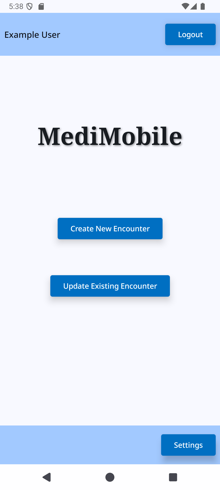
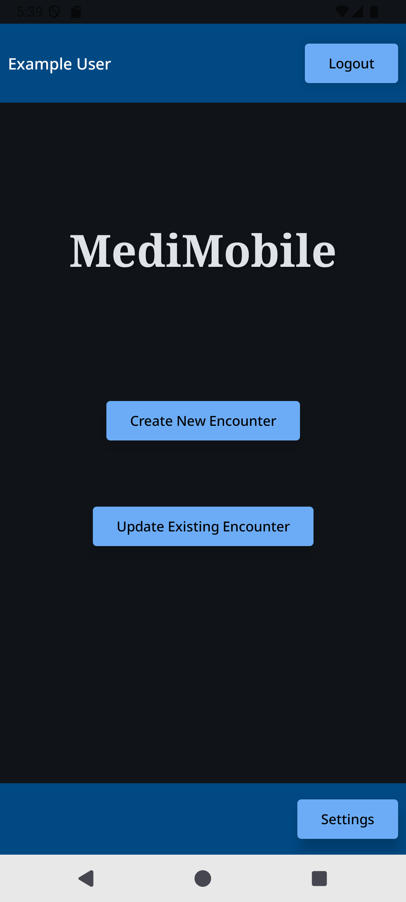
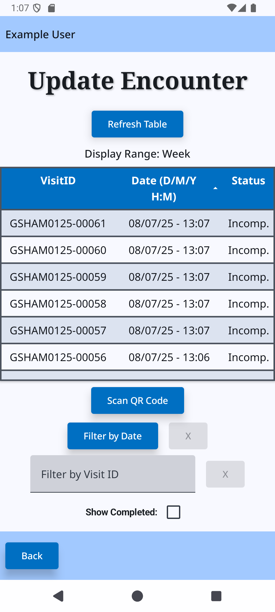

# MediMobile

MediMobile is a mobile Android application designed to allow for real-time data entry into the mediform database.

---

## Table of Contents

- [Features](#features)
- [Screenshots](#screenshots)
- [Getting Started](#getting-started)
- [Architecture](#architecture)
- [Tech Stack](#tech-stack)
- [Testing](#testing)

---

## Features

- **Event Selection**: Dynamically populates all dropdown menu options based on the currently selected event.
- **Secure Login**: Login logic handled by the Mediform backend.
- **Data Entry**: Three-stage data entry process for Patient Encounters, based on a predetermined Minimum Data Set.
- **Data Retrieval**: View and filter existing Mediform Patient Encounters.
- **QR Code Scanning**: Scan QR codes to easily link a Patient Encounter to a specific Visit ID.
- **Light and Dark Modes**: Automatically adjusts the app's colour theme based on the device's settings. 
- **Low-Connectivity Support**: Increase the timeout duration when connecting to the database in order to better handle low-connectivity environments.

---

## Screenshots

### Main Menu Screen

<p>
  
  
</p>

*Left: Light mode | Right: Dark mode*

### Data Entry and Update Encounter Screens

<p>
  
  
</p>

*Left: Data Entry Screen (Arrival Stage) | Right: Update Encounter Screen*

---

## Getting Started

### Requirements

This project requires the following to run locally:

- Android Studio Giraffe (2023.3.1) or newer
- Kotlin 2.0.0
- Gradle 8.0+
- Android device or emulator with API level 26+
- JVM version: Java 17+

### Installation

To install the app, clone the repo with the following command:

```bash
git clone https://github.com/MGM-Interest-Group/medimobile
```

### Running the App

You can run MediMobile using Android Studio, either on an emulator or a physical Android device.

#### Option 1: Using an Emulator

1. Open the project in **Android Studio**.
2. Select **Run > Run 'app'** or click the green play button.
3. Choose an existing emulator or create a new one.
4. The app will build and launch in the emulator.

#### Option 2: On a Physical Device

1. On your Android device:
    - Enable **Developer Options**:
        1. Open the **Settings** app.
        2. Scroll down and tap **About phone**.
        3. Find the **Build number** and tap it **seven times**.
            - You’ll see a message saying "You are now a developer!"
    - Go back to **Settings > System > Developer options**.
    - Enable **USB Debugging**.
2. Connect the device via USB and confirm the "Allow USB debugging" prompt on the phone.
3. In Android Studio, select your device from the device dropdown.
4. Click **Run** to build and install the app.

---

## Architecture

MediMobile follows the **MVVM** (Model-View-ViewModel) architecture:

- `ViewModel`: Handles UI logic and exposes state via `StateFlow`
- `UI`: Built entirely with Jetpack Compose
- `Navigation`: Managed using Jetpack Compose Navigation
- `Data Access`: Network calls are handled directly in the ViewModel or in helper classes (no dedicated repository layer)

---

## Tech Stack

| Layer        | Technology                       |
|--------------|----------------------------------|
| Language     | Kotlin                           |
| UI           | Jetpack Compose                  |
| State Mgmt   | ViewModel + StateFlow            |
| QR Scanning  | ZXing                            |
| Data Layer   | Retrofit + Kotlinx Serialization |
| Navigation   | Jetpack Compose Navigation       |
| Testing      | JUnit, Jetpack Compose Testing   |

---

## Testing

Testing for MediMobile is split into **Unit Tests** (tests for specific functions), and **Instrumentation Tests** (tests that use a device or emulator to simulate user interaction with various screens)

### Unit Tests

To run the unit test suite, use the following command:

```bash
./gradlew testDebugUnitTest
```

### Instrumentation (UI) Tests

To run the instrumentation test suite, you must first either connect an android device to the computer via USB, or start an instance of an emulated device through Android Studio. Then, enter the following command:

```bash
./gradlew connectedDebugAndroidTest
```

The test files are located in:

- `src/test/` – Unit Tests
- `src/androidTest/` – Instrumentation tests

---


